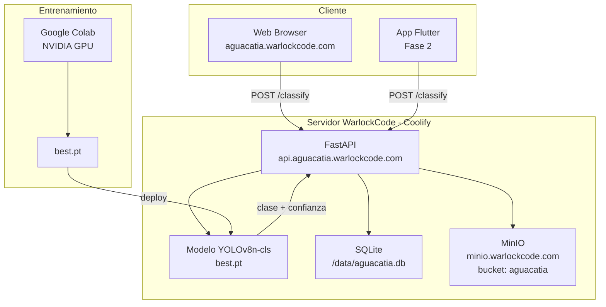

# Aguacatia 🥑

**Sistema de clasificación visual de aguacates Hass mediante visión por computador**

Sistema de inteligencia artificial que clasifica el estado de maduración de aguacates Hass a partir de fotografías, utilizando YOLOv8 como modelo de clasificación de imágenes y una API REST en FastAPI para su consumo desde web y dispositivos móviles.

---

## Clasificación

El modelo identifica 5 etapas de maduración:

| Etapa | Nombre | Estado |
|-------|--------|--------|
| 1 | **Unripe** | Verde amarillento — no apto para consumo |
| 2 | **Breaking** | Verde oliva grisáceo — en transición |
| 3 | **Ripe First Stage** | Manchas púrpuras — casi listo |
| 4 | **Ripe Second Stage** | Piel púrpura uniforme — punto óptimo |
| 5 | **Overripe** | Deterioro visible — descartado |

---

## Arquitectura



---

## Stack

| Capa | Tecnología |
|------|-----------|
| Modelo ML | YOLOv8n-cls (Ultralytics) |
| Entrenamiento | Google Colab (GPU NVIDIA) |
| API | FastAPI + Python 3.11 |
| Base de datos | SQLite en volumen Docker |
| Storage | MinIO S3 |
| Web | Jinja2 + HTMX |
| App móvil | Flutter (Fase 2) |
| Deploy | Coolify + Docker + Traefik |

---

## Dataset

**Hass Avocado Ripening Photographic Dataset**
- 14.710 fotografías JPG · 800×800 px · Hass Avocado real
- Autores: Xavier, P., Rodrigues, P., Silva, C. L. M. (2024)
- Licencia: CC BY 4.0
- DOI: [10.17632/3xd9n945v8.1](https://doi.org/10.17632/3xd9n945v8.1)

---

## Estructura del proyecto

```
aguacatia/
├── docs/           # Documentación nivel maestría (Markdown + Mermaid)
├── notebooks/      # Notebook Google Colab para entrenamiento
├── dataset/        # Scripts de preparación del dataset
├── api/            # Backend FastAPI
├── web/            # Frontend Python + Jinja2 + HTMX
└── infra/          # Configuración Coolify / Docker Compose
```

---

## Quickstart (desarrollo local)

```bash
# 1. Clonar
git clone https://github.com/jmmana/aguacatia.git
cd aguacatia

# 2. Preparar dataset (requiere ZIP del dataset Mendeley)
cd dataset
python prepare_dataset.py --zip ~/Downloads/"Hass Avocado Ripening Photographic Dataset.zip"
python split_dataset.py

# 3. Entrenar (abrir en Google Colab)
# notebooks/01_entrenamiento_yolov8.ipynb

# 4. Copiar modelo entrenado
cp ruta/al/best.pt api/model/best.pt

# 5. Levantar con Docker Compose
docker compose up --build
```

---

## Documentación

Ver carpeta [`docs/`](docs/) para la documentación completa:

- [01 - Introducción](docs/01-introduccion.md)
- [02 - Dataset](docs/02-dataset.md)
- [03 - Arquitectura](docs/03-arquitectura.md)
- [04 - Entrenamiento del modelo](docs/04-entrenamiento.md)
- [05 - API REST](docs/05-api.md)
- [06 - Interfaz web](docs/06-web.md)
- [07 - Métricas y evaluación](docs/07-metricas.md)
- [08 - Despliegue en producción](docs/08-despliegue.md)

---

## Citación del dataset

> Xavier, P., Rodrigues, P., & Silva, C. L. M. (2024). *Hass Avocado Ripening Photographic Dataset* [Data set]. Mendeley Data. https://doi.org/10.17632/3xd9n945v8.1
