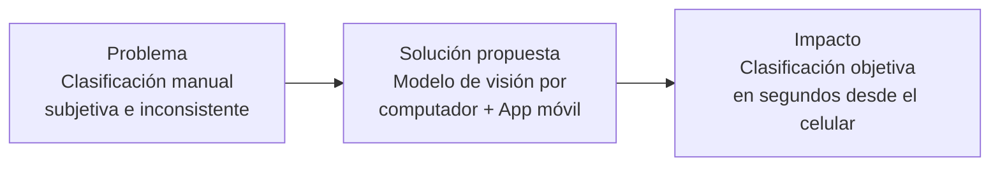
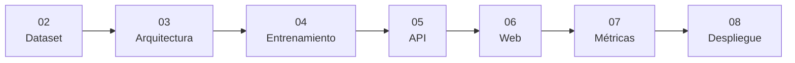

# 01 — Introducción

## 1.1 Contexto del problema

La evaluación del estado de maduración del aguacate Hass (*Persea americana* cv. Hass) se realiza actualmente de manera manual, basándose en la experiencia visual de agricultores, comercializadores y consumidores. Este proceso es subjetivo, inconsistente entre evaluadores y poco escalable para operaciones de alto volumen como las de fincas productoras o supermercados.

Colombia es uno de los principales productores mundiales de aguacate Hass, con creciente demanda tanto en el mercado nacional como en exportaciones. Una clasificación visual precisa y automática representa un valor directo para la cadena productiva.

---

## 1.2 Motivación

El proyecto surge de una necesidad real: dos integrantes del equipo poseen fincas productoras de aguacate Hass, lo que garantiza acceso a material visual auténtico y variado durante el ciclo de desarrollo y validación.

---

## 1.3 Objetivo general

Desarrollar e implementar un sistema de clasificación de imágenes capaz de identificar visualmente el estado de maduración de un aguacate Hass a partir de fotografías tomadas desde un dispositivo móvil, con retroalimentación en tiempo real al usuario.

---

## 1.4 Objetivos específicos

1. Construir y preparar un dataset de imágenes de aguacates Hass para entrenamiento supervisado.
2. Entrenar un modelo de clasificación YOLOv8n-cls con las 5 etapas de maduración.
3. Evaluar el modelo con métricas estándar: accuracy, precision, recall, F1-score, matriz de confusión, curvas ROC y AUC.
4. Implementar una API REST en FastAPI que sirva las predicciones del modelo.
5. Desarrollar una interfaz web accesible desde cualquier navegador.
6. Implementar una aplicación móvil Flutter que use la cámara del dispositivo (Fase 2).

---

## 1.5 Alcance

El sistema realiza una **estimación visual** del estado de maduración basada exclusivamente en características externas observables:

- Color de la piel (verde → púrpura → negro)
- Textura superficial
- Manchas o deterioro visible
- Brillo y uniformidad de la superficie

**Fuera del alcance:** determinación de maduración interna, contenido de grasa, firmeza o cualquier propiedad que no sea visible en la fotografía.

---

## 1.6 Valor del proyecto

| Dimensión | Valor |
|-----------|-------|
| Sectorial | Aplicado al aguacate Hass — producto agrícola estratégico de Colombia |
| Tecnológico | Visión por computador con YOLOv8, estado del arte en clasificación de imágenes |
| Datos | Dataset real con 14.710 imágenes de laboratorio controlado |
| Usabilidad | App móvil: el usuario solo apunta y fotografía |
| Académico | Documenta el ciclo completo: datos → modelo → API → aplicación |

---

## 1.7 Estructura del documento

Esta documentación sigue el ciclo completo del proyecto:

