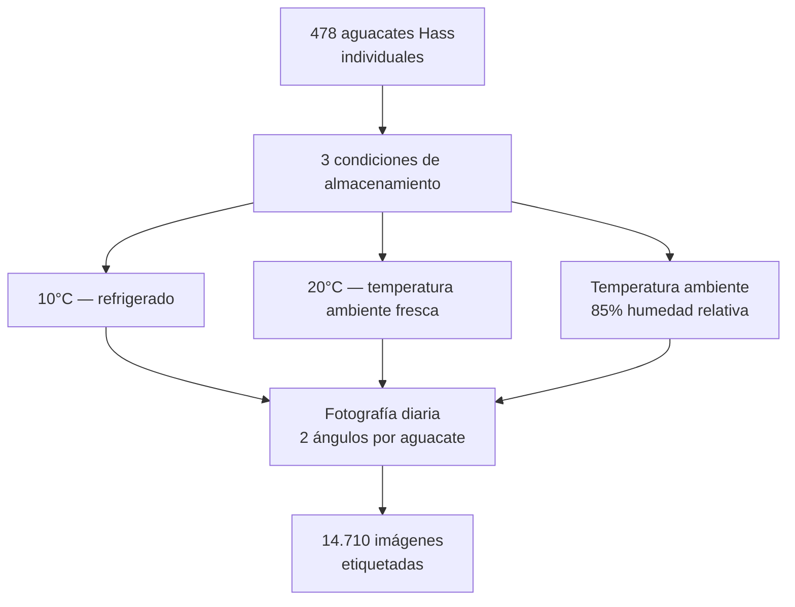

# 02 — Dataset

## 2.1 Fuente de datos

Se utiliza el **Hass Avocado Ripening Photographic Dataset** publicado por investigadores del Centro de Biotecnologia e Química Fina (Portugal) en la plataforma Mendeley Data.

| Campo | Detalle |
|-------|---------|
| Título | Hass Avocado Ripening Photographic Dataset |
| Autores | Pedro Xavier, Pedro Rodrigues, Cristina L. M. Silva |
| Institución | Centro de Biotecnologia e Química Fina, Portugal |
| Año | 2024 |
| DOI | [10.17632/3xd9n945v8.1](https://doi.org/10.17632/3xd9n945v8.1) |
| HuggingFace | [c2p-cmd/hass_avocado](https://huggingface.co/datasets/c2p-cmd/hass_avocado) |
| Licencia | CC BY 4.0 (uso libre con citación) |
| Total imágenes | 14.710 fotografías JPG |
| Resolución | 800 × 800 píxeles |

---

## 2.2 Metodología de recolección original



**Equipo fotográfico:** Canon EOS 60D DSLR con estudio fotográfico controlado (HAVOX-HPB-40D, iluminación LED 5500K).

---

## 2.3 Etiquetas — 5 clases de maduración

| Clase | Nombre | Color de piel | Estado |
|-------|--------|---------------|--------|
| 1 | **Unripe** | Verde amarillento | No apto para consumo |
| 2 | **Breaking** | Verde oliva grisáceo | Inicio de ablandamiento |
| 3 | **Ripe First Stage** | Manchas púrpuras | Casi en punto |
| 4 | **Ripe Second Stage** | Púrpura uniforme | Punto óptimo de consumo |
| 5 | **Overripe** | Manchas de moho / negro | Deteriorado — descartar |

---

## 2.4 Estructura del archivo descargado

```
Hass Avocado Ripening Photographic Dataset/
├── Avocado Ripening Dataset.xlsx     ← etiquetas de cada imagen
└── Avocado Ripening Dataset/
    ├── T10_d01_003_a_1.jpg
    ├── T10_d01_003_b_1.jpg
    └── ... (14.710 imágenes)
```

**Convención de nombres de archivo:**

```
T{temp}_{day}_{id}_{angle}_{batch}.jpg

T10   → condición 10°C
T20   → condición 20°C
Ta    → condición temperatura ambiente
d01   → día 1 de seguimiento
003   → ID del aguacate individual
a / b → ángulo a (frontal) o b (lateral)
1     → número de batch
```

---

## 2.5 Pipeline de preparación del dataset


---

## 2.6 Distribución del split

| Partición | Porcentaje | Imágenes aprox. |
|-----------|-----------|-----------------|
| train | 70% | ~10.297 |
| val | 15% | ~2.207 |
| test | 15% | ~2.207 |

El split se hace **estratificado por clase** para garantizar representación balanceada en cada partición.

---

## 2.7 Consideraciones de calidad

- Las imágenes fueron tomadas en condiciones controladas de iluminación — diferente a fotos de celular en campo real.
- Para mitigar el dominio gap, se aplican aumentos de datos durante el entrenamiento (rotación, flip, brillo, contraste).
- Las condiciones de temperatura afectan el ritmo de maduración, no el aspecto visual de la etapa — no son una variable de confusión para el modelo visual.

---

## 2.8 Citación (CC BY 4.0 — obligatoria)

> Xavier, P., Rodrigues, P., & Silva, C. L. M. (2024). *Hass Avocado Ripening Photographic Dataset* [Data set]. Mendeley Data. https://doi.org/10.17632/3xd9n945v8.1
