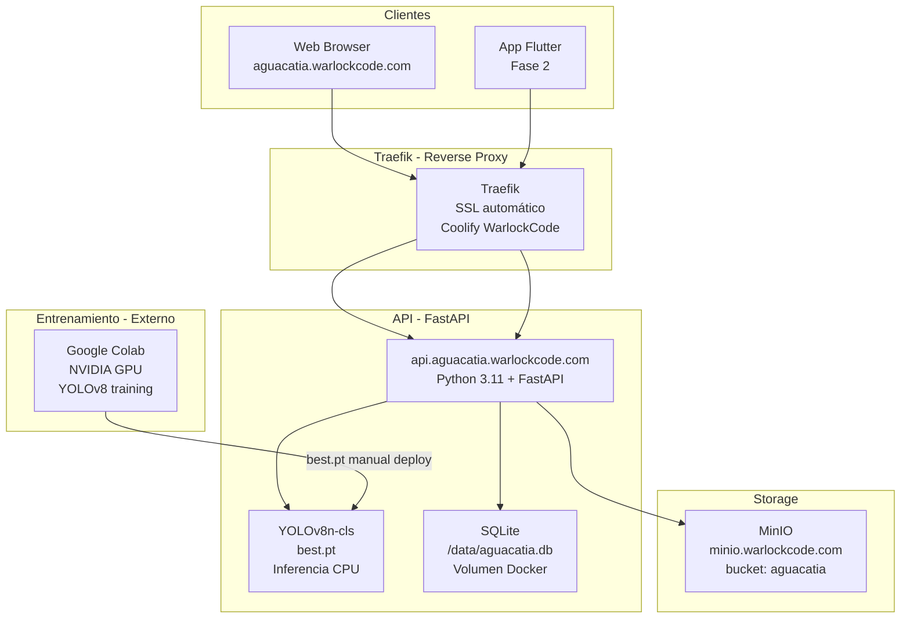
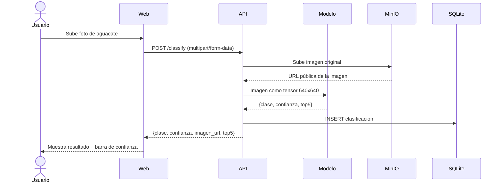
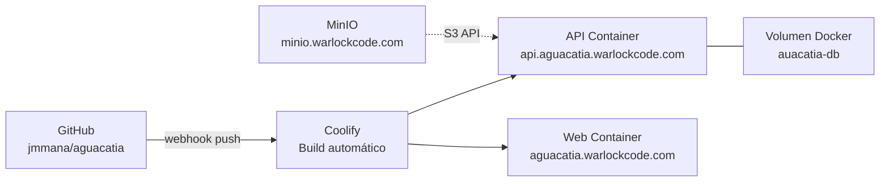

# 03 — Arquitectura del Sistema

## 3.1 Vista general



---

## 3.2 Componentes

### API — FastAPI (Python 3.11)

Punto central del sistema. Recibe imágenes, ejecuta el modelo, guarda el historial y sirve el resultado.

| Endpoint | Método | Descripción |
|----------|--------|-------------|
| `/classify` | POST | Recibe imagen → clasifica → guarda → retorna resultado |
| `/history` | GET | Retorna historial paginado de clasificaciones |
| `/health` | GET | Health check para Coolify |
| `/docs` | GET | Swagger UI automático (FastAPI) |

### Modelo — YOLOv8n-cls

- Variante: `yolov8n-cls` (nano, clasificación de imágenes)
- Entrenado en Google Colab con GPU NVIDIA
- Exportado como `best.pt` (PyTorch)
- Cargado en memoria al iniciar la API
- Inferencia en CPU: ~50–200ms por imagen

### Base de datos — SQLite

Almacenamiento local en volumen Docker. Sin servidor externo.

```sql
CREATE TABLE clasificaciones (
    id          INTEGER PRIMARY KEY AUTOINCREMENT,
    usuario     TEXT NOT NULL,
    imagen_url  TEXT NOT NULL,
    clase       TEXT NOT NULL,
    confianza   REAL NOT NULL,
    fecha_at    TEXT NOT NULL
);
```

### Storage — MinIO S3

Almacenamiento de imágenes clasificadas. Compatible con protocolo S3.

- Endpoint: `minio.warlockcode.com`
- Bucket: `aguacatia`
- Acceso público de lectura para URLs de imágenes en el historial

### Web — Jinja2 + HTMX

Frontend server-side. Sin JavaScript framework pesado.

- HTMX maneja las peticiones AJAX al API
- Jinja2 renderiza las plantillas HTML en el servidor
- Tailwind CSS para estilos

---

## 3.3 Flujo de clasificación



---

## 3.4 Despliegue en Coolify



- Cada push a `main` dispara rebuild automático en Coolify
- El volumen `aguacatia-db` persiste el SQLite entre deploys
- SSL automático vía Traefik + Let's Encrypt

---

## 3.5 Decisiones de diseño

| Decisión | Alternativa descartada | Razón |
|----------|----------------------|-------|
| SQLite | PostgreSQL | Scope académico, sin concurrencia alta, zero config |
| HTMX + Jinja2 | React / Vue | Sin build step, menos complejidad, foco en el backend |
| CPU inference | GPU AMD ROCm | ROCm requiere setup complejo; 50–200ms es aceptable para el caso |
| YOLOv8n-cls | ResNet, EfficientNet | API moderna de Ultralytics, pipeline unificado, exportación simple |
| MinIO compartido | MinIO por proyecto | Reutilizar infraestructura existente; buckets aíslan los proyectos |
