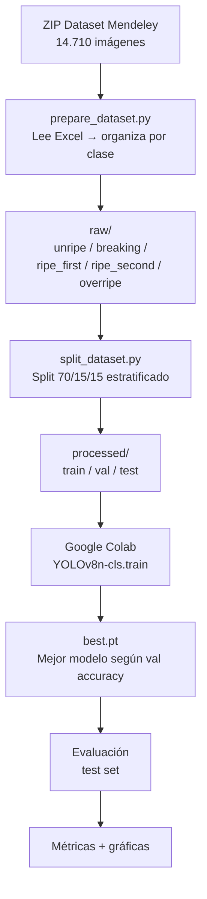
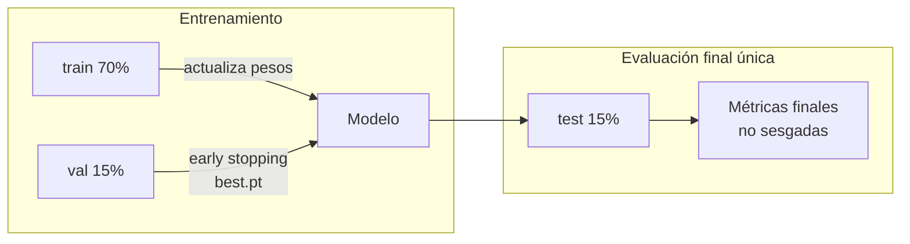

# 04 — Entrenamiento del Modelo

## 4.1 Modelo seleccionado: YOLOv8n-cls

**YOLOv8** (You Only Look Once, versión 8) de Ultralytics es el estado del arte en detección y clasificación de imágenes. La variante **n-cls** (nano, clasificación) es la más ligera y eficiente para inferencia en producción.

| Parámetro | Valor |
|-----------|-------|
| Arquitectura | YOLOv8n-cls |
| Peso base (preentrenado) | ImageNet |
| Epochs máximos | 100 |
| Early stopping | Patience = 15 |
| Tamaño de imagen | 640×640 px |
| Batch size | 32 |
| Dispositivo | Google Colab GPU (NVIDIA T4 / A100) |
| Librería | Ultralytics 8.4.60 |
| PyTorch | 2.11.0+cu128 |
| NumPy | 2.0.2 |

---

## 4.2 Pipeline de entrenamiento



---

## 4.3 Aumentos de datos aplicados

Para reducir el overfitting y mejorar la generalización a fotos reales de celular (diferente dominio al dataset de laboratorio):

| Aumento | Valor | Justificación |
|---------|-------|---------------|
| Variación de hue | ±1.5% | Color del aguacate varía según iluminación |
| Variación de saturación | ±70% | Diferentes condiciones de luz |
| Variación de brillo | ±40% | Luz natural vs. artificial |
| Flip horizontal | 50% | El aguacate puede fotografiarse de cualquier lado |
| Flip vertical | 10% | Ángulo superior / inferior |

---

## 4.4 Estrategia de evaluación

El conjunto de test (15%, estratificado) se usa **una sola vez** al final del entrenamiento. Durante el entrenamiento se usa el conjunto de validación para early stopping y selección del mejor modelo.



---

## 4.5 Notebook de entrenamiento

El notebook completo está en [`notebooks/01_entrenamiento_yolov8.ipynb`](../notebooks/01_entrenamiento_yolov8.ipynb).

**Para ejecutar:**
1. Abrir en Google Colab
2. Activar GPU: `Entorno de ejecución → Cambiar tipo de entorno → T4 GPU`
3. Subir el ZIP del dataset a Google Drive en `Mi unidad/aguacatia/`
4. Ejecutar todas las celdas en orden (~30–60 min con GPU T4)
5. El notebook guarda automáticamente `best.pt` en Google Drive

---

## 4.6 Resultados reales de entrenamiento

### Run 1 — Google Colab T4 GPU (2026-06-05)

| Parámetro | Valor |
|-----------|-------|
| GPU | NVIDIA T4 (16 GB VRAM) |
| Duración | ~45 min |
| Epochs completados | ~45 (early stopping en patience=15) |
| Top-1 accuracy (val) | ~82.7% (epoch 30) |
| Modelo guardado | `best.pt` — 2.98 MB |

> **Este es el modelo actualmente desplegado en producción.**

---

### Run 2 — Google Colab A100-SXM4-40GB (2026-06-06)

El runtime T4 no estuvo disponible; Colab asignó automáticamente un A100.

**Dataset confirmado:**

| Clase | Train | Val | Test | Total |
|-------|------:|----:|-----:|------:|
| unripe | 2.497 | 535 | 536 | 3.568 |
| breaking | 1.559 | 334 | 335 | 2.228 |
| ripe_first | 1.929 | 413 | 414 | 2.756 |
| ripe_second | 2.305 | 494 | 495 | 3.294 |
| overripe | 2.004 | 429 | 431 | 2.864 |
| **TOTAL** | **10.294** | **2.205** | **2.211** | **14.710** |

**Resultados evaluación test set:**

| Métrica | Valor |
|---------|-------|
| Accuracy (test) | 35.2% |
| AUC macro | 0.588 |
| Duración total | 1:55:46 |

**Análisis:** La accuracy del 35.2% es significativamente menor que el random baseline esperado de 38-42% para clases levemente desbalanceadas. Posibles causas:

1. **`imgsz=640` para clasificación** — YOLOv8-cls está optimizado para 224–320 px en clasificación; 640 px introduce ruido de fondo sin aportar información discriminativa para aguacates.
2. **Diferencia de dominio A100 vs T4** — El scheduler de LR de Ultralytics usa la misma tasa base independientemente del throughput de la GPU. En A100 el modelo procesa epochs mucho más rápido, lo que puede causar que el LR decaiga antes de que el modelo converja.
3. **Early stopping prematuro** — Con patience=15 y convergencia inestable, el modelo puede haberse detenido en un mínimo local.

**Recomendación para re-entrenamiento:** Reducir `imgsz` a 320, aumentar `patience` a 30, y evaluar con `imgsz=224` (estándar para clasificación fine-grained).

---

## 4.7 Uso del modelo entrenado

Una vez obtenido `best.pt`:

```bash
# Copiar al API
cp ~/Downloads/best.pt api/model/best.pt

# Probar localmente
cd aguacatia
python -c "
from api.services.predictor import predict
with open('foto_aguacate.jpg', 'rb') as f:
    result = predict(f.read())
print(result)
"
```

**Salida esperada:**
```python
{
  'clase': 'ripe_second',
  'clase_display': 'Ripe Second Stage — Punto óptimo',
  'confianza': 0.9134,
  'top5': [...]
}
```
