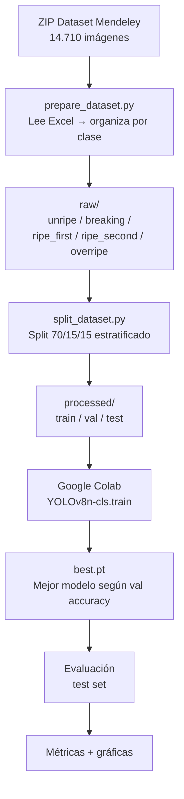
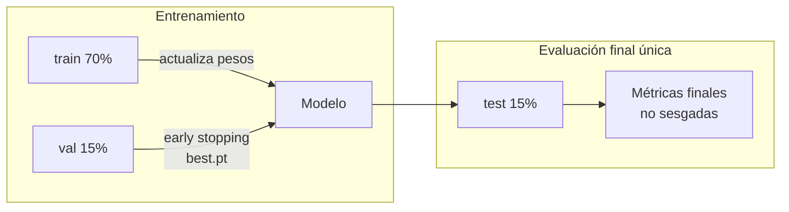

# 04 — Entrenamiento del Modelo

## 4.1 Modelo seleccionado: YOLOv8n-cls

**YOLOv8** (You Only Look Once, versión 8) de Ultralytics es el estado del arte en detección y clasificación de imágenes. La variante **n-cls** (nano, clasificación) es la más ligera y eficiente para inferencia en producción.

| Parámetro | Valor |
|-----------|-------|
| Arquitectura | YOLOv8n-cls |
| Peso base (preentrenado) | ImageNet |
| Epochs máximos | 100 |
| Early stopping | Patience = 15 |
| Tamaño de imagen | 640×640 px |
| Batch size | 32 |
| Dispositivo | Google Colab GPU (NVIDIA T4) |

---

## 4.2 Pipeline de entrenamiento



---

## 4.3 Aumentos de datos aplicados

Para reducir el overfitting y mejorar la generalización a fotos reales de celular (diferente dominio al dataset de laboratorio):

| Aumento | Valor | Justificación |
|---------|-------|---------------|
| Variación de hue | ±1.5% | Color del aguacate varía según iluminación |
| Variación de saturación | ±70% | Diferentes condiciones de luz |
| Variación de brillo | ±40% | Luz natural vs. artificial |
| Flip horizontal | 50% | El aguacate puede fotografiarse de cualquier lado |
| Flip vertical | 10% | Ángulo superior / inferior |

---

## 4.4 Estrategia de evaluación

El conjunto de test (15%, estratificado) se usa **una sola vez** al final del entrenamiento. Durante el entrenamiento se usa el conjunto de validación para early stopping y selección del mejor modelo.



---

## 4.5 Notebook de entrenamiento

El notebook completo está en [`notebooks/01_entrenamiento_yolov8.ipynb`](../notebooks/01_entrenamiento_yolov8.ipynb).

**Para ejecutar:**
1. Abrir en Google Colab
2. Activar GPU: `Entorno de ejecución → Cambiar tipo de entorno → T4 GPU`
3. Subir el ZIP del dataset a Google Drive en `Mi unidad/aguacatia/`
4. Ejecutar todas las celdas en orden (~30–60 min con GPU T4)
5. El notebook guarda automáticamente `best.pt` en Google Drive

---

## 4.6 Uso del modelo entrenado

Una vez obtenido `best.pt`:

```bash
# Copiar al API
cp ~/Downloads/best.pt api/model/best.pt

# Probar localmente
cd aguacatia
python -c "
from api.services.predictor import predict
with open('foto_aguacate.jpg', 'rb') as f:
    result = predict(f.read())
print(result)
"
```

**Salida esperada:**
```python
{
  'clase': 'ripe_second',
  'clase_display': 'Ripe Second Stage — Punto óptimo',
  'confianza': 0.9134,
  'top5': [...]
}
```
