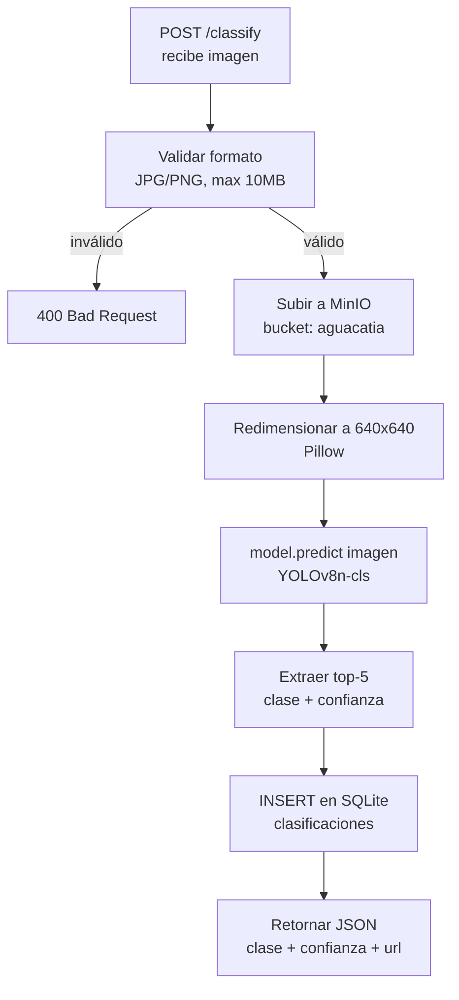

# 05 — API REST (FastAPI)

## 5.1 Descripción general

La API es el núcleo del sistema. Recibe imágenes desde la web o la app móvil, ejecuta la inferencia con el modelo YOLOv8, persiste el resultado en SQLite y retorna la clasificación con su nivel de confianza.

- **Framework:** FastAPI (Python 3.11)
- **URL producción:** `https://api.aguacatia.warlockcode.com`
- **Documentación interactiva:** `https://api.aguacatia.warlockcode.com/docs`

---

## 5.2 Endpoints

### POST /classify

Clasifica una imagen de aguacate.

**Request:**
```
Content-Type: multipart/form-data
Fields:
  - file: imagen JPG/PNG (obligatorio)
  - usuario: nombre del evaluador (opcional, default: "anonimo")
```

**Response 200:**
```json
{
  "id": 42,
  "clase": "ripe_second",
  "clase_display": "Ripe Second Stage",
  "confianza": 0.91,
  "imagen_url": "https://minio.warlockcode.com/aguacatia/uuid.jpg",
  "top5": [
    {"clase": "ripe_second", "confianza": 0.91},
    {"clase": "ripe_first",  "confianza": 0.07},
    {"clase": "breaking",    "confianza": 0.01},
    {"clase": "unripe",      "confianza": 0.01},
    {"clase": "overripe",    "confianza": 0.00}
  ],
  "fecha_at": "2024-06-05T14:32:10Z"
}
```

### GET /history

Retorna el historial de clasificaciones paginado.

**Query params:**
- `page` (int, default: 1)
- `limit` (int, default: 20, max: 100)
- `usuario` (str, opcional — filtra por usuario)

**Response 200:**
```json
{
  "total": 150,
  "page": 1,
  "limit": 20,
  "items": [
    {
      "id": 42,
      "usuario": "juan",
      "clase": "ripe_second",
      "clase_display": "Ripe Second Stage",
      "confianza": 0.91,
      "imagen_url": "https://minio.warlockcode.com/aguacatia/uuid.jpg",
      "fecha_at": "2024-06-05T14:32:10Z"
    }
  ]
}
```

### GET /health

Health check para Coolify.

**Response 200:**
```json
{"status": "ok", "model": "loaded"}
```

---

## 5.3 Flujo interno de /classify



---

## 5.4 Estructura de archivos

```
api/
├── main.py              # FastAPI app, CORS, startup
├── routes/
│   ├── classify.py      # POST /classify
│   └── history.py       # GET /history
├── models/
│   └── database.py      # SQLite schema + conexión aiosqlite
├── services/
│   ├── predictor.py     # Carga best.pt, preprocesa, predice
│   └── storage.py       # Upload a MinIO vía boto3
├── model/
│   └── best.pt          # Modelo entrenado (se sube post-Colab)
├── requirements.txt
└── Dockerfile
```

---

## 5.5 Variables de entorno

| Variable | Descripción | Ejemplo |
|----------|-------------|---------|
| `MINIO_ENDPOINT` | URL MinIO | `minio.warlockcode.com` |
| `MINIO_ACCESS_KEY` | Usuario MinIO | `grimorio` |
| `MINIO_SECRET_KEY` | Contraseña MinIO | `***` |
| `MINIO_BUCKET` | Nombre del bucket | `aguacatia` |
| `DB_PATH` | Ruta del SQLite | `/data/aguacatia.db` |
| `MODEL_PATH` | Ruta del modelo | `/app/model/best.pt` |

---

## 5.6 Clases del modelo

| Clave interna | Display |
|---------------|---------|
| `unripe` | Unripe (Verde — no apto) |
| `breaking` | Breaking (Transición) |
| `ripe_first` | Ripe First Stage (Casi listo) |
| `ripe_second` | Ripe Second Stage (Punto óptimo) |
| `overripe` | Overripe (Deteriorado) |
