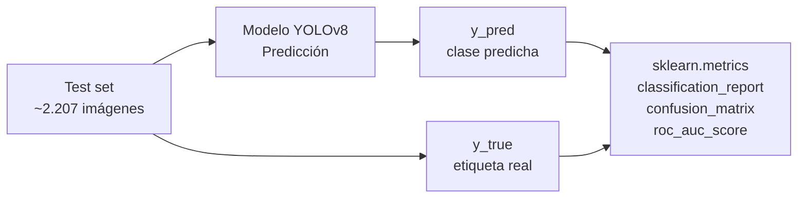
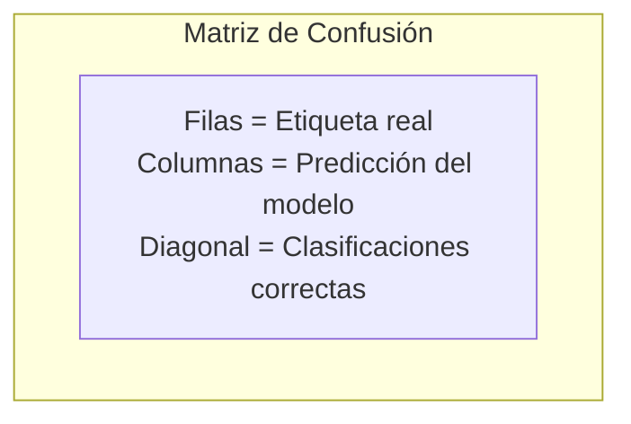

# 07 — Métricas y Evaluación del Modelo

## 7.1 Métricas utilizadas

El modelo se evalúa con el conjunto de test (15% del dataset, ~2.207 imágenes), usando las siguientes métricas estándar de clasificación multiclase:

| Métrica | Descripción |
|---------|-------------|
| **Accuracy** | Proporción de predicciones correctas sobre el total |
| **Precision** | De lo que el modelo predice como clase X, cuánto era realmente X |
| **Recall** | De todo lo que es clase X, cuánto identificó el modelo |
| **F1-Score** | Media armónica de Precision y Recall |
| **Matriz de confusión** | Tabla NxN con predicciones vs. etiquetas reales |
| **Curvas ROC** | Tasa de verdaderos positivos vs. falsos positivos por clase |
| **AUC** | Área bajo la curva ROC — 1.0 es perfecto |

---

## 7.2 Cálculo de métricas (OvR para multiclase)

Para 5 clases se usa la estrategia **One-vs-Rest (OvR)**: se calcula cada métrica para cada clase tomándola como positiva y el resto como negativa. Luego se promedian (macro average).



---

## 7.3 Formato de reporte esperado

```
                    precision  recall  f1-score  support
         unripe       0.XX      0.XX     0.XX      XXX
       breaking       0.XX      0.XX     0.XX      XXX
     ripe_first       0.XX      0.XX     0.XX      XXX
    ripe_second       0.XX      0.XX     0.XX      XXX
       overripe       0.XX      0.XX     0.XX      XXX

       accuracy                          0.XX     2207
      macro avg       0.XX      0.XX     0.XX     2207
   weighted avg       0.XX      0.XX     0.XX     2207
```

---

## 7.4 Matriz de confusión (5x5)



Se espera mayor confusión entre clases adyacentes (ej. `breaking` ↔ `ripe_first`), ya que son etapas continuas de maduración con características visuales similares.

---

## 7.5 Objetivo de desempeño

| Métrica | Objetivo mínimo | Objetivo ideal |
|---------|-----------------|----------------|
| Accuracy | > 75% | > 85% |
| F1 macro | > 0.70 | > 0.82 |
| AUC macro | > 0.85 | > 0.92 |

---

## 7.6 Análisis de errores

Además de las métricas numéricas, se documenta:

- **Casos correctos representativos** — imágenes bien clasificadas con alta confianza
- **Casos incorrectos** — imágenes mal clasificadas y posible razón
- **Efecto de la iluminación** — comparar imágenes con buena vs. mala iluminación
- **Efecto del ángulo** — comparar ángulos a (frontal) vs. b (lateral)
- **Confianza baja** — predicciones con confianza < 0.60 y su distribución por clase

---

## 7.7 Limitaciones conocidas

1. **Dominio gap:** el dataset fue tomado en estudio fotográfico controlado. Fotos de celular en campo real pueden tener peor desempeño.
2. **Clases adyacentes:** `breaking` y `ripe_first` son visualmente similares — mayor tasa de error esperada entre ellas.
3. **Fondo variable:** el modelo puede verse afectado por fondos complejos en fotos reales.
4. **Escala del aguacate:** imágenes donde el aguacate es muy pequeño o está parcialmente visible.
