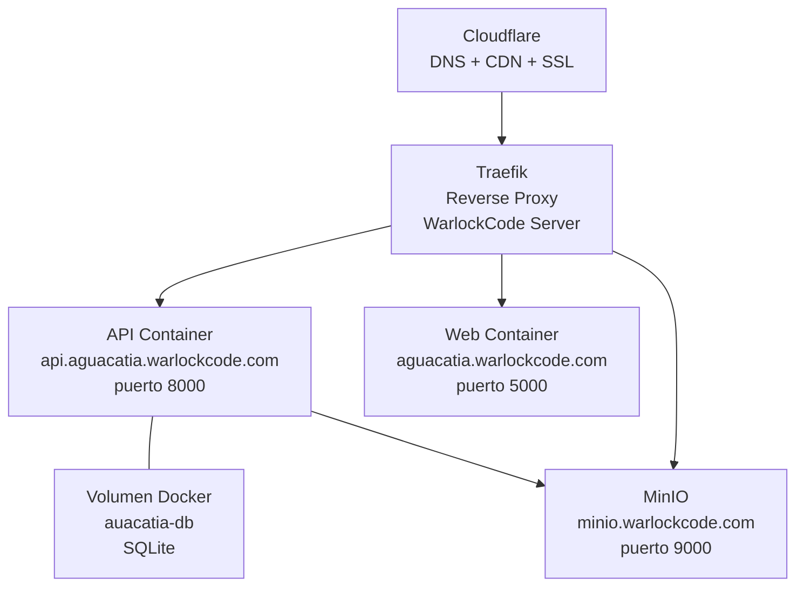
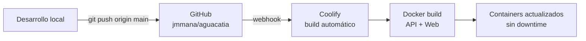

# 08 — Despliegue en Producción

## 8.1 Infraestructura



## 8.2 URLs de producción

| Servicio | URL |
|---------|-----|
| Web (clasificador) | `https://aguacatia.warlockcode.com` |
| API REST | `https://api.aguacatia.warlockcode.com` |
| API Docs (Swagger) | `https://api.aguacatia.warlockcode.com/docs` |
| MinIO API S3 | `https://minio.warlockcode.com` |
| MinIO Console | `https://console.minio.warlockcode.com` |

---

## 8.3 Variables de entorno en producción

### API (`api.aguacatia.warlockcode.com`)

| Variable | Valor |
|----------|-------|
| `MINIO_ENDPOINT` | `minio.warlockcode.com` |
| `MINIO_ACCESS_KEY` | `grimorio` |
| `MINIO_SECRET_KEY` | *(secret en Coolify)* |
| `MINIO_BUCKET` | `aguacatia` |
| `DB_PATH` | `/data/aguacatia.db` |
| `MODEL_PATH` | `/app/model/best.pt` |

### Web (`aguacatia.warlockcode.com`)

| Variable | Valor |
|----------|-------|
| `API_URL` | `https://api.aguacatia.warlockcode.com` |

---

## 8.4 Proceso de deploy



1. Hacer `git push` a `main`
2. Coolify detecta el push vía webhook y reconstruye los contenedores
3. El volumen `aguacatia-db` persiste entre deploys (SQLite no se pierde)
4. El archivo `best.pt` se monta desde el volumen — se actualiza manualmente

---

## 8.5 Actualizar el modelo

Cuando se entrene una versión mejorada del modelo:

```bash
# 1. Descargar best.pt de Google Colab/Drive
# 2. Subir al servidor vía Coolify o SCP
scp best.pt warlockcode@ssh.warlockcode.com:/path/to/model/best.pt

# 3. Reiniciar el contenedor API para recargar el modelo
# En Coolify: proyecto Maestria → aguacatia-api → Restart
```

---

## 8.6 Health check

La API expone un endpoint de health check que Coolify usa para verificar el estado:

```bash
curl https://api.aguacatia.warlockcode.com/health
# {"status": "ok", "model": "loaded"}
```

Si `model` retorna `"not_loaded"`, el archivo `best.pt` no está disponible.

---

## 8.7 DNS requeridos en Cloudflare

| Tipo | Nombre | Destino | Proxy |
|------|--------|---------|-------|
| A | `aguacatia` | IP del servidor | ✅ |
| A | `api.aguacatia` | IP del servidor | ✅ |
| A | `minio` | IP del servidor | ✅ |
| A | `console.minio` | IP del servidor | ✅ |
